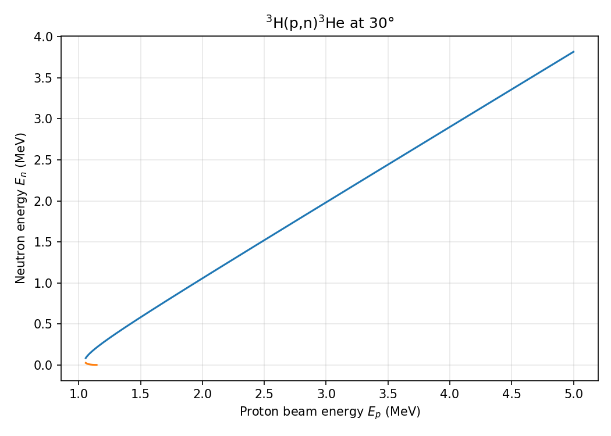

# reaction-kinematics
This is a Python library for calculating relativistic two-body nuclear reaction kinematics.

This package is designed for students and researchers working in nuclear and particle physics who need fast, reliable kinematic calculations for reactions of the form:

```
projectile + target → ejectile + recoil
```

---

## Features 
This code can do:
* Relativistic two-body kinematics
* Automatic unit handling
* Center-of-mass and lab-frame quantities
* Energy, angle, momentum, and velocity calculations
* Support for multi-valued kinematic solutions
* Simple plotting and data export

---

## Installation


```
pip install reaction-kinematics
```


---

## Documentation 

https://det-lab.github.io/reaction-kinematics/

## Basic Usage

The main interface is the `TwoBody` class.

```python
from reaction_kinematics import TwoBody
```

Create a reaction by specifying the particle masses and projectile kinetic energy.

## Units

* Masses are internally stored in MeV/c²
* Energies are in MeV by default
* Velocities are given as fractions of c
* Angles are in radians

You may specify alternative units using `EnergyUnit` and `MassInput`.


### Example: Proton + Tritium Reaction

```python
rxn = TwoBody("p", "3H", "n", "3He", 1.2)
```

This represents:

```
p + 3H → n + 3He
```

with a projectile energy of 1.2 MeV.

---

## Computing Kinematic Arrays

To generate arrays of kinematic quantities over all center-of-mass angles, use `compute_arrays()`.

```python
data = rxn.compute_arrays()
```

This will return a dictionary containing the following:

* `coscm`   : cos(θ_CM)
* `theta_cm`: CM angle (rad)
* `theta3`  : Ejectile lab angle (rad)
* `theta4`  : Recoil lab angle (rad)
* `e3`      : Ejectile energy (MeV)
* `e4`      : Recoil energy (MeV)
* `v3`      : Ejectile velocity (c)
* `v4`      : Recoil velocity (c)

### Example

```python
theta4 = data["theta4"]
e3 = data["e3"]
```

---

## Accessing Individual Values

To evaluate kinematic quantities at a specific value, use `at_value()`.

This method automatically handles multi-valued solutions and always returns lists.

### Syntax

```python
rxn.at_value(x_name, x_value, y_names=None)
```

Parameters:

* `x_name` : Independent variable (e.g. `"theta4"`, `"theta_cm"`, `"coscm"`)
* `x_value`: Value at which to evaluate
* `y_names`: Dependent variables (string or list)

---

## Example: Single Quantity

```python
import math

angle = 10 * math.pi / 180

vals = rxn.at_value("theta4", angle, y_names="e3")
print(vals)
```

Output:

```
{'e3': [0.3447, 0.0364]}
```

Multiple values indicate multiple physical solutions.

---

## Example: Multiple Quantities

```python
vals = rxn.at_value(
    "theta4",
    angle,
    y_names=["e3", "v3", "p3"]
)

print(vals)
```

Example output:

```
{
  'e3': [0.3447, 0.0364],
  'v3': [0.025, 0.009],
  'p3': [23.7, 8.2]
}
```

---

## Example: Full State at a Given CM Angle

If `y_names` is omitted, all quantities are returned.

```python
vals = rxn.at_value("theta_cm", 0.8)
print(vals)
```

Example output:

```
{
  'coscm': [...],
  'theta3': [...],
  'theta4': [...],
  'e3': [...],
  'e4': [...],
  'v3': [...],
  'v4': [...],
  'p3': [...],
  'p4': [...]
}
```

### Convert to NumPy Arrays

```python
import numpy as np

data = rxn.compute_arrays()

theta4 = np.array(data["theta4"])
e3 = np.array(data["e3"])
```

### Using Explicit Mass Values

```python
rxn = TwoBody(
    938.272,
    11177.928,
    938.272,
    11177.928,
    5.0,
    mass_unit="MeV"
)
```

---

## Plotting Example

You can use `matplotlib` to visualize kinematic relationships.

### Example: Ejectile Energy vs Recoil Angle

```python
import matplotlib.pyplot as plt

data = rxn.compute_arrays()

plt.plot(data["theta4"], data["e3"])
plt.xlabel("Recoil Angle θ₄ (rad)")
plt.ylabel("Ejectile Energy E₃ (MeV)")
plt.title("E₃ vs θ₄")
plt.grid(True)
plt.show()
```

---

## Kinematic Curves at Fixed Lab Angle

`kinematic_curve` sweeps over a range of beam energies at a **fixed lab angle**,
returning ejectile kinematics for both solution branches.

```python
import numpy as np
import matplotlib.pyplot as plt
from reaction_kinematics import kinematic_curve

ek_array = np.linspace(1.0, 5.0, 500)
branches = kinematic_curve("p", "3H", "n", "3He", np.deg2rad(30), ek_array)

for branch in branches:
    plt.plot(branch["ek"], branch["e3"])

plt.xlabel("Proton beam energy $E_p$ (MeV)")
plt.ylabel("Neutron energy $E_n$ (MeV)")
plt.show()
```

Each call returns a list of **two dicts** (branch 0 = high-energy solution,
branch 1 = low-energy solution), each containing arrays for `ek`, `e3`, `e4`,
`theta4`, `v3`, and `v4`. Where a branch does not exist the values are `NaN`.



The full example script is at [`examples/kinematic_curve_example.py`](examples/kinematic_curve_example.py).

---

## Numerical Notes

* Some kinematic variables are multi-valued.
* Near kinematic extrema, solution branches may merge numerically.
* The library automatically removes duplicate solutions within tolerance of 1e**-6.

---

## License

GPL-2.0 license

---

## Contact

For questions, issues, or contributions, please open an issue on GitHub.


* * *

## Project Docs

For how to install uv and Python, see [installation.md](installation.md).

For development workflows, see [development.md](development.md).

For instructions on publishing to PyPI, see [publishing.md](publishing.md).

* * *

*This project was built from
[simple-modern-uv](https://github.com/jlevy/simple-modern-uv).*

