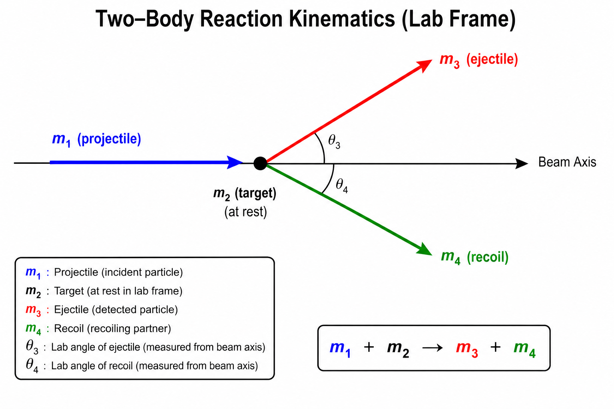

# Welcome to Reaction Kinematics 
This is a Python library for calculating relativistic two-body nuclear reaction kinematics.

This package is designed for students and researchers working in nuclear and particle physics who need reliable relativistic kinematic calculations for reactions of the form:

```
projectile + target → ejectile + recoil
```


This code can do:

 * Relativistic two-body kinematics
 * Center-of-mass and lab-frame quantities
 * Energy, angle, momentum, and velocity calculations
 * Support for multi-valued kinematic solutions
<br>

## Install
```
pip install reaction-kinematics
```

## How to use

Create a reaction by specifying the four particle masses. The beam energy is passed separately to each calculation method.

### Reaction 
We define a reaction with these variables

* mass1 (Projectile)
* mass2 (Target)
* mass3 (Ejectile)
* mass4 (Recoil)

All masses are converted internally to MeV. Kinetic energy is assumed in MeV unless specified otherwise.

For example, for the reaction ³H(p,n)³He:
```python
from reaction_kinematics import Reaction

# or equivalently: 
# rxn = Reaction("3H(p,n)3He")
rxn = Reaction("p", "3H", "n", "3He")
```

### Units 

* Masses are internally stored in MeV/c²
* Energies are in MeV by default — supported units: `keV`, `MeV`, `GeV`, `TeV`
* Velocities are given as fractions of c
* Angles are in degrees by default — supported units: `deg`, `rad`, `mrad`

### Compute Arrays
To generate arrays of kinematic quantities over all center-of-mass angles, use `kinematics_table_at_beam_energy(beam_energy)`.  The units for `beam_energy` are MeV by default but can be specified by the user using the `energy_unit` keyword.

```python
data = rxn.kinematics_table_at_beam_energy(4.0)
```

This will return a dictionary containing the following:

* `cos_theta_cm`  : cos(θ_CM)
* `theta_cm`      : CM angle (deg)
* `theta3_lab`    : Ejectile lab angle (deg)
* `theta4_lab`    : Recoil lab angle (deg)
* `energy3_lab`   : Ejectile energy (MeV)
* `energy4_lab`   : Recoil energy (MeV)
* `velocity3_lab` : Ejectile velocity (unitless, reported as a fraction of c)
* `velocity4_lab` : Recoil velocity (unitless, reported as a fraction of c)
* `momentum3_lab` : Ejectile momentum (MeV/c)
* `momentum4_lab` : Recoil momentum (MeV/c)

###### See [Plotting Example](plotting.md) for How to Plot


