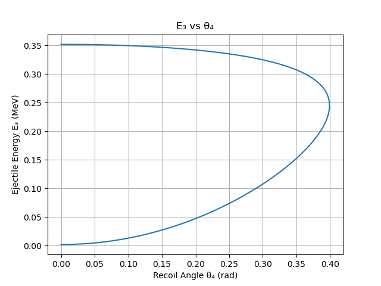

## Plotting Example

You can use `matplotlib` to visualize kinematic relationships.

### Example: Ejectile Energy vs Recoil Angle

```python
from reaction_kinematics import Reaction
import matplotlib.pyplot as plt

rxn = Reaction("p", "3H", "n", "3He")
# Proton + Tritium Reaction

data = rxn.kinematics_table_at_beam_energy(1.2)

plt.plot(data["theta4"], data["e3"])
plt.xlabel("Recoil Angle θ₄ (rad)")
plt.ylabel("Ejectile Energy E₃ (MeV)")
plt.title("E₃ vs θ₄")
plt.grid(True)
plt.show()
```
It should return a graph like this: 


---

## Kinematic Curves at Fixed Lab Angle

`kinematics_curve_at_angle` sweeps over a range of beam energies at a **fixed lab angle**,
returning ejectile kinematics for both solution branches.

```python
import numpy as np
import matplotlib.pyplot as plt
from reaction_kinematics import Reaction

rxn = Reaction("p", "3H", "n", "3He")
beam_energy_array = np.linspace(1.0, 5.0, 500)
branches = rxn.kinematics_curve_at_angle(beam_energy_array, np.deg2rad(30))

for branch in branches:
    plt.plot(branch["ek"], branch["e3"])

plt.xlabel("Proton beam energy $E_p$ (MeV)")
plt.ylabel("Neutron energy $E_n$ (MeV)")
plt.show()
```

Each call returns a list of **two dicts** (branch 0 = high-energy solution,
branch 1 = low-energy solution), each containing arrays for `ek`, `e3`, `e4`,
`theta4`, `v3`, and `v4`. Where a branch does not exist the values are `NaN`.


The full example script is at [`examples/kinematic_curve_example.py`](https://github.com/det-lab/reaction-kinematics/blob/main/examples/kinematic_curve_example.py).

---
